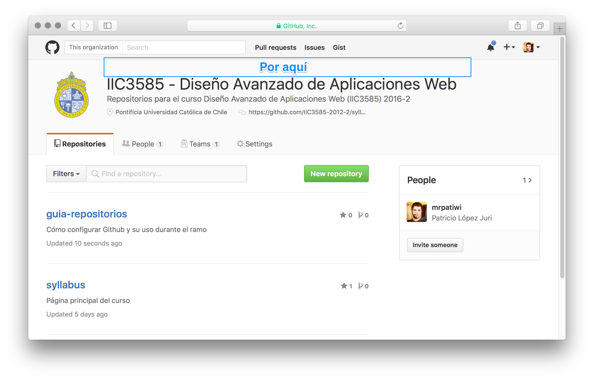
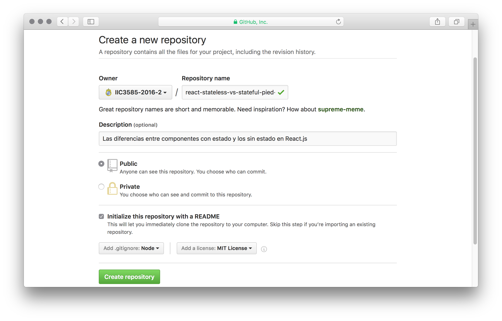
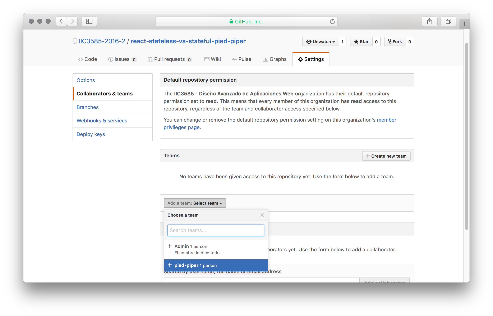
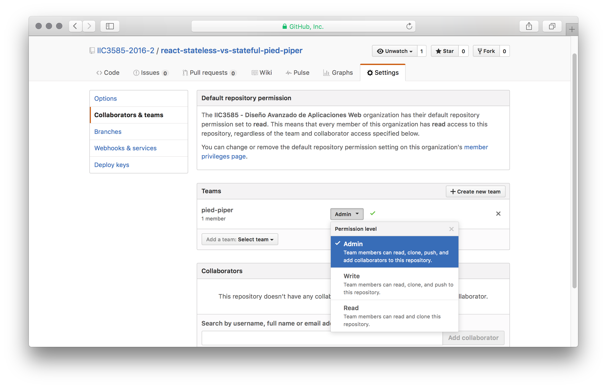

# Guía Repositorios

Cómo configurar Github y su uso durante el ramo

## Pre-requisitos:

### Cuenta en Github

Se debe contar con una cuenta en [Github]() y asegurarse de [contestar el formulario](https://goo.gl/forms/xBoyFR7hfD3dSGV73) para ser incluído en esta organización.

Te llegará un correo con un botón para aceptar la invitación al correo asociado a Github.

En caso contrario, puedes revisar la página principal de la organización y en la parte superior (sobre el título) aparecerá un mensaje para aceptarla.



## Repositorios

### Creación para cada tarea

Lo mejor es dejar cada proyecto en un propio repositorio, así tenemos un `git log` más ordenado y no mezclamos peras con manzanas.

La convención para nombrar los repos con el fin de facilitar la búsqueda es la siguiente:

```txt
<framework>-<tema>-<grupo>
```

> Nuevamente con nombres en **minúsculas** y con `-` para los espacios por [esta razón](https://docs.npmjs.com/files/package.json#name).

Por ejemplo, si es un trabajo sobre las diferencias entre componentes con estado y los sin estado en [React.js]():

```sh
react-stateless-vs-stateful-pied-piper
```

Todo esto se realiza en la dirección [github.com/organizations/IIC3585-2019/repositories/new](https://github.com/organizations/IIC3585-2019/repositories/new):



### Asignación de colaboradores y equipo

Para que tu compañero sea capaz de aportar con commits directamente, es necesario que sea agregado el equipo al que perteneces con permisos de **Admin** o de **Write**:



